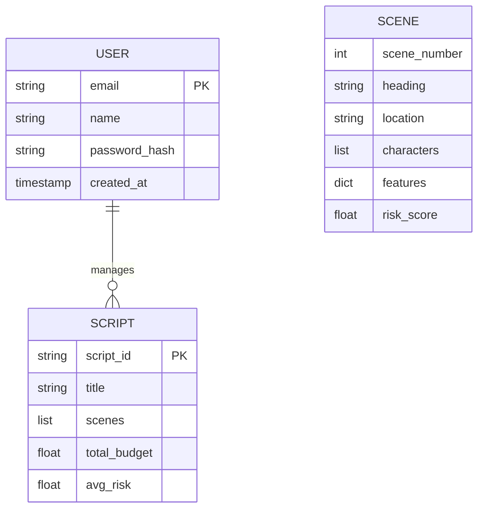

# ScriptOps: AI-Powered Film Production Assistant 🎬

**ScriptOps** is an advanced, full-stack application designed to revolutionize film pre-production. It analyzes screenplay text, automatically splits it into scenes, extracts logistical features (VFX, stunts, locations), calculates budget and risk estimates, and provides actionable insights powered by **Groq** and the **LLaMA 3.3** model.

---

### 🔗 [Visit Live Application](https://scriptops.vercel.app/)

---

### ✨ Landing Page Experience
The ScriptOps landing page guides users through the core value propositions of AI-driven production.

| Hero Section | High-Level Vision |
| :---: | :---: |
|  |  |

| "Shatter the Narrative" (UI1) | "Detect Danger Early" (UI2) | "Precision Forecasting" (UI3) |
| :---: | :---: | :---: |
|  |  |  |

---

### 🔐 User Onboarding (Authentication)
A secure, streamlined entry point featuring real-time email verification.

| Sign In | Create Account | OTP Verification |
| :---: | :---: | :---: |
|  |  |  |

---

### 🖥️ Core Dashboard & Analysis
The heart of the application, where data meets production strategy.

| Risk Analysis Heatmap | AI Script Intelligence (Chat) |
| :---: | :---: |
|  |  |

| Script Inventory Archive | Script Ingestion/Upload | User Configuration |
| :---: | :---: | :---: |
|  |  |  |

---

### 🚀 Key Features
- **Automated Script Parsing**: Upload screenplays (`.txt`/`.pdf`) for instant scene tokenization and location extraction.
- **Risk & Budget Estimation**: Algorithmically detects high-risk elements (stunts, VFX, etc.) and calculates production difficulty scores.
- **What-If Simulator**: Tweak scene parameters and watch estimated budgets recalculate in real-time.
- **AI Production Assistant**: A context-aware chatbot (Powered by Groq) for deep script analysis and cost optimization.

---

## 💾 Data Architecture
The system uses a lightweight JSON-based storage for user management and script metadata, designed for zero-latency in-memory operations.

---

## 🏗️ Architecture: The Intelligence Flow
When a screenplay is uploaded:
1. **Parsing**: The engine tokenizes the text into discrete scenes.
2. **Extraction**: A feature-extraction layer identifies production requirements.
3. **Scoring**: The Risk Engine applies weighted multipliers to calculate difficulty.
4. **Insight Generation**: Data is passed to **Groq (LLaMA 3.3)** to generate strategic insights.

---

### Environment Variables
Configure the following in your cloud provider:
- `GROQ_API_KEY`: Groq Inference Engine API key.
- `SENDGRID_API_KEY`: SendGrid API key for emails.
- `SENDGRID_FROM_EMAIL`: Verified SendGrid sender address.
- `JWT_SECRET`: Secret key for token generation.
- `FRONTEND_URL`: Your Vercel deployment URL (for CORS).

---

Distributed under the MIT License. See `LICENSE` for more information.

---
**Developed to demonstrate AI-driven automation in film production and production-ready cloud deployment.**
