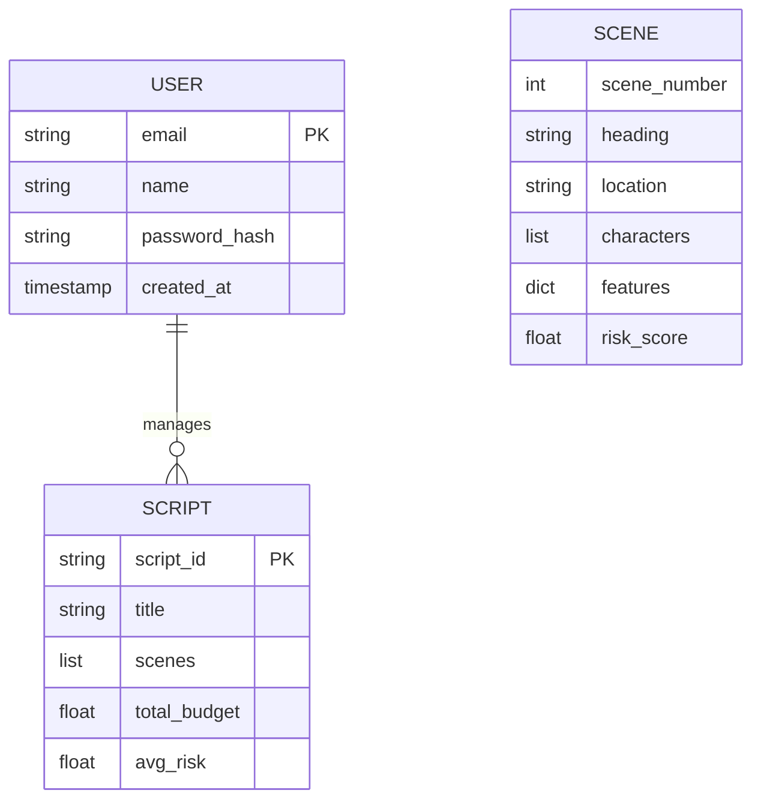

# ScriptOps: AI-Powered Film Production Assistant 🎬

**ScriptOps** is an advanced, full-stack application designed to revolutionize film pre-production. It analyzes screenplay text, automatically splits it into scenes, extracts logistical features (VFX, stunts, locations), calculates budget and risk estimates, and provides actionable insights powered by **Groq** and the **LLaMA 3.3** model.


---

### 🖥️ Core Platform
| Home Page | Risk Analysis Dashboard |
| :---: | :---: |
|  |  |

### 🤖 AI Intelligence & Insights
| Scene-Level Insights | AI Production Assistant (Chat) |
| :---: | :---: |
|  |  |

### 🔐 Authentication
| Sign In | Create Account |
| :---: | :---: |
|  |  |

---

### ✨ Automated Script Intelligence
- **Automated Script Parsing**: Upload screenplays (`.txt`/`.pdf`) for instant scene tokenization, location extraction, and character count analysis.
- **Risk & Budget Estimation**: Algorithmically detects high-risk elements (stunts, animals, VFX, pyrotechnics) and calculates production risk scores (0-100).
- **What-If Simulator**: Tweak scene parameters (e.g., changing a VFX-heavy Night shoot to a Day shoot) and watch the estimated budget recalculate in real-time.

### 🤖 AI-Powered Production Strategy
- **Executive Summaries**: Instant production summaries, key concerns, and cost optimization recommendations per scene via **Groq**.
- **Interactive Assistant**: A context-aware chatbot that acts as your production manager, deeply aware of script context and budget parameters.
- **Visual Dashboards**: Risk heatmaps and budget distribution charts for a data-driven overview of your shooting schedule.

### ✉️ Production-Ready Delivery
- **SendGrid Integration**: Professional OTP verification flow using the SendGrid API to ensure reliable delivery in cloud environments.
- **Robust Authentication**: Secure JWT-based session management with native bcrypt hashing.

---

## 💾 Data Architecture
The system uses a lightweight JSON-based storage for user management and script metadata, designed for zero-latency in-memory operations.



---

## 🏗️ Architecture: The Intelligence Flow
When a screenplay is uploaded:
1. **Parsing**: The engine tokenizes the text into discrete scenes based on industry-standard screenplay headings.
2. **Extraction**: A feature-extraction layer identifies production requirements (stunts, VFX, vehicles, night shoots).
3. **Scoring**: The Risk Engine applies weighted multipliers to calculate the "Production Difficulty" and "Estimated Budget".
4. **Insight Generation**: Data is passed to **Groq (LLaMA 3.3)** to generate strategic insights and populate the interactive production assistant.

---

### Environment Variables
Configure the following in your `.env` or cloud provider:
- `GROQ_API_KEY`: Your Groq Inference Engine API key.
- `SENDGRID_API_KEY`: SendGrid API key for emails.
- `SENDGRID_FROM_EMAIL`: Your verified SendGrid sender address.
- `JWT_SECRET`: Secret key for token generation.
- `FRONTEND_URL`: Your Vercel deployment URL (for CORS).

### Local Development
1. **Backend**
   ```bash
   cd backend
   pip install -r requirements.txt
   python -m uvicorn main:app --port 8000 --reload
   ```
2. **Frontend**
   ```bash
   cd frontend
   npm install
   npm run dev
   ```

---

Distributed under the MIT License. See `LICENSE` for more information.

---
**Developed to demonstrate AI-driven automation in film production, production-ready cloud deployment, and advanced NLP script analysis.**
