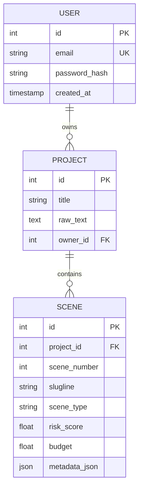

# ScriptOps: AI-Powered Film Production Assistant 🎬

**ScriptOps** is an advanced, full-stack application designed to revolutionize film pre-production. It analyzes screenplay text, automatically splits it into scenes, extracts logistical features (VFX, stunts, locations), calculates budget and risk estimates, and provides actionable insights powered by **Groq** and the **LLaMA 3.3** model.

---

### 🔗 [Visit Live Application](https://scriptops.vercel.app/)
### ⚙️ [API Documentation (Backend)](https://scriptops-1.onrender.com/docs)

---

### ✨ Landing Page Experience
The ScriptOps landing page guides users through the core value propositions of AI-driven production.

| Hero Section | High-Level Vision |
| :---: | :---: |
|  |  |

| "Shatter the Narrative" (UI1) | "Detect Danger Early" (UI2) | "Precision Forecasting" (UI3) |
| :---: | :---: | :---: |
|  |  |  |

---

### 🔐 User Onboarding (Authentication)
A secure, streamlined entry point featuring real-time email verification and **persistent PostgreSQL storage**.

| Sign In | Create Account | OTP Verification |
| :---: | :---: | :---: |
|  |  |  |

---

### 🖥️ Core Dashboard & Analysis
The heart of the application, where data meets production strategy.

| Risk Analysis Heatmap | AI Script Intelligence (Chat) |
| :---: | :---: |
|  |  |

| Script Inventory Archive | Script Ingestion/Upload | User Configuration |
| :---: | :---: | :---: |
|  |  |  |

---

### 🚀 Key Features
- **Automated Script Parsing**: Upload screenplays (`.txt`/`.pdf`) for instant scene tokenization and location extraction.
- **Persistent Data Storage**: All users, projects, and analyses are saved in a **Neon PostgreSQL** database for long-term accessibility.
- **Real-Time Simulation**: Tweak risk tolerance and crew matching weights via the new **System Config** dropdown to watch budgets recalculate instantly.
- **One-Click Exports**: Professional **PDF Reports** and **Final Draft (.FDX)** exports generated on-demand.
- **AI Production Assistant**: A context-aware chatbot (Powered by Groq) for deep script analysis and cost optimization.

---

## 💾 Data Architecture
ScriptOps utilizes a robust relational database schema managed by **SQLAlchemy** to ensure data integrity and persistence.

---

## 🏗️ Architecture: The Intelligence Flow
1. **Parsing**: Screenplays are tokenized into discrete scenes.
2. **Extraction**: A feature-extraction layer identifies production requirements using NLP.
3. **Scoring**: The Risk Engine applies weighted multipliers (customizable by user) to calculate difficulty.
4. **Persistence**: Results are committed to the PostgreSQL cloud instance.
5. **Insight Generation**: Analysis data is passed to **Groq (LLaMA 3.3)** for strategic planning.

---

### Environment Variables
Configure the following in your cloud provider:
- `DATABASE_URL`: Connection string for your **Neon/PostgreSQL** instance.
- `GROQ_API_KEY`: Groq Inference Engine API key.
- `SENDGRID_API_KEY`: SendGrid API key for emails.
- `SENDGRID_FROM_EMAIL`: Verified SendGrid sender address.
- `JWT_SECRET`: Secret key for token generation.
- `FRONTEND_URL`: Your Vercel deployment URL (for CORS).

---

Distributed under the MIT License. See `LICENSE` for more information.

---
**Developed to demonstrate AI-driven automation in film production and production-ready cloud deployment.**
